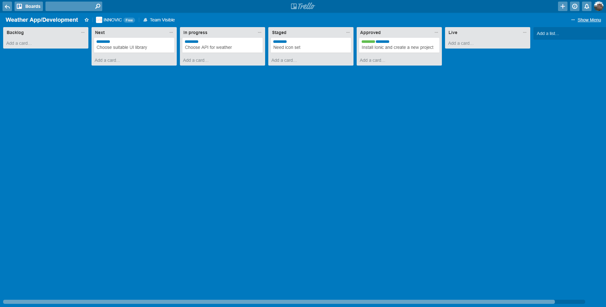
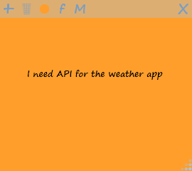

# **INNOVIC'S PROCESS OF WORK** # 

**_The whole is greater than the sum of its parts._ - Aristotle**

## **Trello boards** ##

We use Kanban(ish) method for development.

First of all, for every project it is desirable to create a board.

A new **Trello board** is empty, ready to organize any of your projects:

 

A board represents a project or a place to keep track of information. No matter if you are launching a new **website** or a new **application** or any other thing, a Trello board is the place to organize your tasks as cards on lists and collaborate with your team.

**You will create separate boards for development, bugs, improvements or any other things which you may find necessary for your project.**

For example, if a project name is: **Weather app**, we will create three boards: 

- Weather App
- Weather App | Bugs
- Weather App | Improvements

### **Lists** ###

In every board section board lists have to be created (when it comes to lists, there’s no right or wrong way to go. It’s all about creating a structure for your board that works for you, no matter how you work). In our case, we organize them this way : 

- **backlog** - Job defined by business owner or product manager
- **next** - Cards marked for development by business owner or product manager
- **in progress** - Card taken by developer
- **staged** - Ready for testing
- **approved** - Tested by QA team and business owner
- **live** - Deployed, published

Lists keep cards organized in their various stages of progress. They can be used to create a workflow where cards are moved across lists from start to finish, or simply act as a place to keep track of ideas and information. Of course, there’s no limit to the number of lists you can add to a board.

#### **Cards** ####

The basic unit of a board is a **card**. Cards are used to represent tasks and ideas. A card can be something that needs to be done, whether you are working on an development, improvement or a bug. Drag and drop cards across lists to show progress. There’s no limit to the number of cards you can add to a board.
Cards have different **levels of severity**, the highest priority have those with highest level of severity, meaning that those most important ones come first when working on a project.
You have to, obviously, give a card a **name**. Whether your new card represents a task, an idea, or just a piece of information, card names should be clear, concise, and sometimes even fun.

##### **Card labels** #####

We like to label our cards in this way:

**Development board**

- **Require estimate - blue label**
- **Estimate approved - green label**
- **Blocked - black label**

In a development board, we also put labels for different components of project, like this:

- **API - violet**
- **Front End - pink**
- **Integration with Zapier - orange**

**Bug board**

- **Critical - red**
- **Medium - orange**
- **Low - green**
- **Blocked - black label**

**Improvements board**

- **Critical - red**
- **Medium - orange**
- **Low - green**
- **Just an idea -- blue**

**However, these labels can be different depending on the board you create.**

#### **Card structure** ####

##### **Card description** #####

To add details to your card click **Edit the description** at the top of the card back. This is a good place to explain the issues as detailed as possible. In the description field you can add more specific information about your card, links to websites, attachments or step by step directions.

We like to do it like this:

- If it is a card about a **bug**, in the edit the description section we explain how to reproduce the existing bug, the browser where we found it its current version etc. Bug cards are chosen by the level of severity (most serious ones have the advantage over others).

- If it is a card about a **new feature**, in the edit the description section we try to describe this feature and how to demo it.

- If it is a card about an **improvement**, in the edit the description section we explain how to reproduce it and suggest the possible solution for an improvement.

##### **Comments and Activity** ##### 

Comments can be added to cards when communicating and collaborating with team members, like giving feedback or updates. **@** mention a member of your board or team in a comment and they will receive a notification in Trello. The activity feed shows the history of comments and actions that have taken place on a card and creates a timeline of events as progress is made, such as when a card is moved to a different list, or someone completes a checklist item.

##### **Add section** #####

The **Add** section provides you with more tools that the card offers:

- **Add board members** to cards to assign them tasks. Members added to cards will receive notifications for actions on that card.
- **Add Labels** for categories and tags, which can be named and filtered.
- **Add Checklists** for cards that require subtasks or have multiple steps to make sure nothing is left behind. You can even copy checklists from other cards on the board.
- **Add a Due date** to cards with deadlines, and card members will receive a notification 24 hours before it’s due. Once the tasks are completed, due dates can be marked as done.
- **Add Attachments** from both your computer and many cloud storage services like Dropbox, Google Drive, Box, and OneDrive.

## **Daily scrum** ##

**Daily scrum** is a 15 minute event, held at the same time each working day, where the **development team** gathers to synchronise their activitis and prepare a plan for the day that is ahead of them. Daily scrum enhances team collboration and performance by inspecting the work since the last daily scrum and preparing work for the next day. During the daily scrum, each team member answers the following three questions:

- What did you do yesterday?
- What will you do today?
- Are there any obstacles in your way?

By focusing on what each person accomplished yesterday and will accomplish today, the team gains an excellent understanding of what work has been done and what work remains. 

## **Stories** ##

**Stories** are short descriptions of a small piece of desired functionality, written in the user’s language.

As you can see, they’re short, simple descriptions of functionality usually told from the user’s perspective and written in their language. 

On the other hand, there are **enabler stories**, the way how developing team responds to a user story. Enabler stories bring visibility to the work items needed to support exploration, architecture, infrastructure, and compliance.

 **Agile Teams** implement small, vertical slices of system functionality and are sized so they can be completed in a single **Iteration (single development cycle)**.

## **Story points** ##

**Story points** are a unit of measure for expressing an estimate of the overall effort that will be required to fully implement a product or any other piece of work.
Because story points represent the effort to develop a story, a team’s estimate must include everything that can affect the effort. That could include:

- The amount of work to do
- The complexity of the work
- Any risk or uncertainty in doing the work
- Discussions regarding a task
- Refactoring the code
- Testing ( often 20% of time )

## **Iteration** ##

In agile software development, an **iteration** is a single development cycle, usually two weeks period. Each iteration ends with an inspection of the team’s progress, as well as an updated backlog for the next iteration. Next, the team prepares and participates in the **System Demo** that gives an integrated view of the new **Features** for the most recent iteration delivered by all the teams.

## **Other tools we use** ##

- We use **Slack**, because every team needs to communicate.
- For meeting and video calls we use combination of **Slack** calls and **Zoom**.
- For screenshots we use **Shutter** ( Ubuntu ) or **Greenshot** ( Windows )
- For collaboration writing and meeting notes we use **Google docs**.